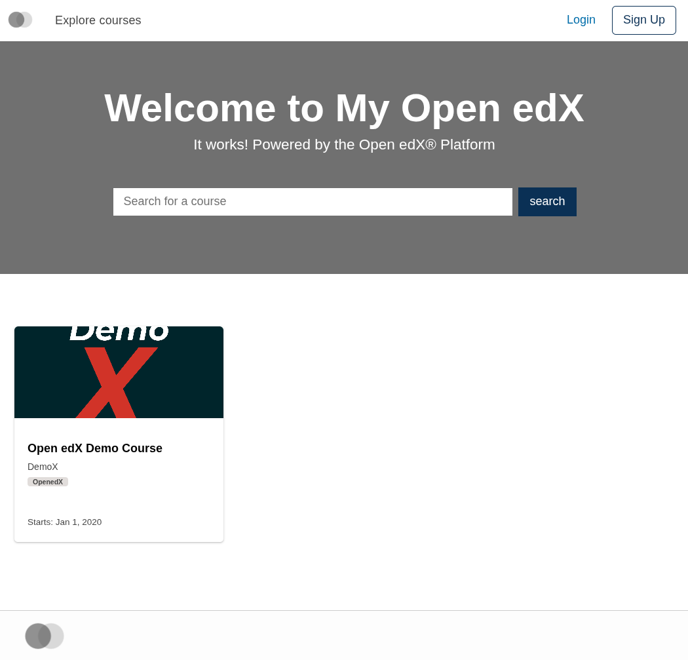
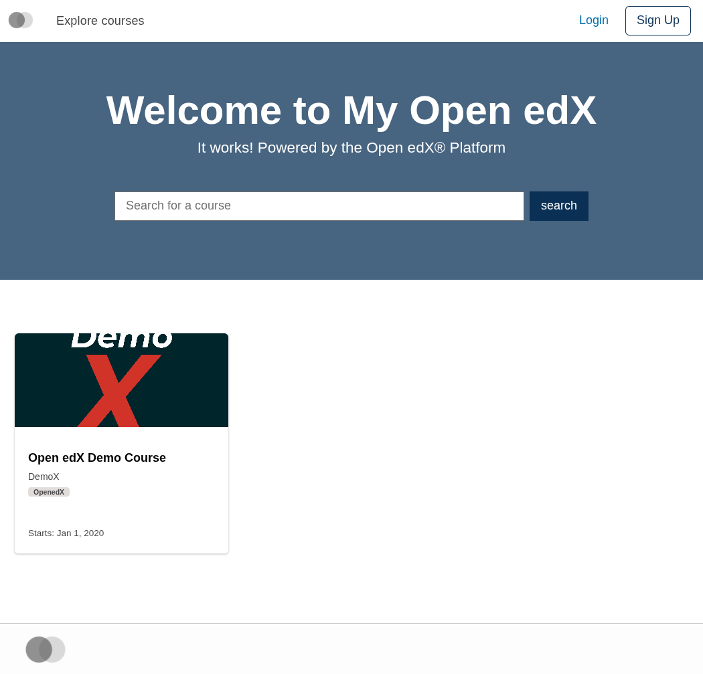

# Test Theme

Manual verification fixture for [#4274](https://github.com/openedx/paragon/issues/4274) — application token support.

This is not a published brand package. It exists on the [`app-tokens-test`](https://github.com/brian-smith-tcril/paragon/tree/app-tokens-test) branch as a working example used to verify, against a real MFE, that the `apps/` token convention introduced on [`app-tokens`](https://github.com/brian-smith-tcril/paragon/tree/app-tokens) actually overrides MFE-defined CSS variables in production.

## Result

Tested against `frontend-app-catalog`'s home page. The MFE's banner uses:

```scss
background-color: var(--catalog-home-page-banner-background-color, var(--pgn-color-gray-500));
```

When no brand override is loaded, the banner falls back to `--pgn-color-gray-500`:



When this test theme's `dist/light.min.css` is loaded as `brandOverride`, the banner picks up `--catalog-home-page-banner-background-color: var(--pgn-color-primary-400)`:



## How `dist/` was built

The commands below are recorded for reference — they document what produced the committed output, not instructions for a consumer to follow.

The single source token at [`src/tokens/src/apps/catalog/home-page.json`](./src/tokens/src/apps/catalog/home-page.json) defines `catalog.home-page.banner.background-color` as a reference to `{color.primary.400}`. From `test-theme/src/`:

```sh
node ../../bin/paragon-scripts.js build-tokens \
  --source ./tokens/src \
  --build-dir ./paragon/css \
  --source-tokens-only --exclude-core --themes light

node ../../bin/paragon-scripts.js build-scss \
  --themesPath ./paragon/css/themes \
  --outDir ../dist \
  --excludeCore --defaultThemeVariants light
```

`build-tokens` produces `apps/catalog/variables.css` (containing the unprefixed `--catalog-…` declaration) and a theme `index.css` that `@import`s it. `build-scss` then bundles the theme with the app override into a single `dist/light.min.css`.

The intermediate `paragon/css/` directory is gitignored; only `dist/` is committed so jsdelivr can serve it.

## `env.config.jsx` used for the screenshots

Placed at the root of a local `frontend-app-catalog` checkout:

```jsx
const config = {
  PARAGON_THEME_URLS: {
    variants: {
      light: {
        urls: {
          default: 'https://cdn.jsdelivr.net/npm/@openedx/paragon@latest/dist/light.min.css',
          brandOverride: 'https://cdn.jsdelivr.net/gh/brian-smith-tcril/paragon@app-tokens-test/test-theme/dist/light.min.css',
        },
      },
    },
  },
};

export default config;
```

`default` provides Paragon's own theme CSS (which declares `--pgn-color-primary-400`); `brandOverride` is the URL to this directory's `dist/light.min.css` served via jsdelivr. Both load on `:root`; the `--catalog-home-page-banner-background-color` declaration from the override resolves at runtime against the `--pgn-color-primary-400` declaration from the default.
